Understanding QC parameters
===========================

    library(ggplot2)
    #check how percent and mean fd are related:
    aDF_ <- read.csv('../../Phenotypic_V1_0b_preprocessed1.csv')
    aDF <- aDF_[aDF_$AGE_AT_SCAN >= 6 & aDF_$AGE_AT_SCAN <= 18,]
    aplot <- ggplot(aDF, aes(y=func_mean_fd, x=func_perc_fd))+
        geom_point(alpha=.3)+
        geom_smooth()
    print(aplot)

    ## Warning: Removed 13 rows containing non-finite values (stat_smooth).

    ## Warning: Removed 13 rows containing missing values (geom_point).

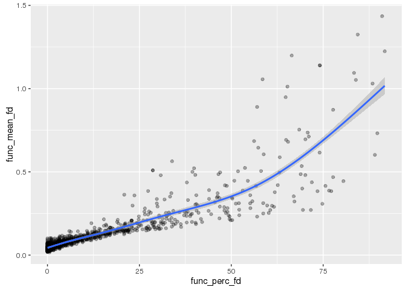<!-- -->

    qplot(aDF$func_perc_fd)

    ## `stat_bin()` using `bins = 30`. Pick better value with `binwidth`.

    ## Warning: Removed 13 rows containing non-finite values (stat_bin).

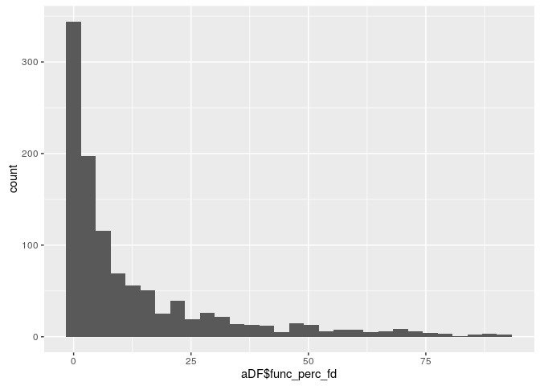<!-- -->

    summary(glm(round(func_perc_fd) ~ AGE_AT_SCAN, family='quasipoisson', data=aDF))

    ## 
    ## Call:
    ## glm(formula = round(func_perc_fd) ~ AGE_AT_SCAN, family = "quasipoisson", 
    ##     data = aDF)
    ## 
    ## Deviance Residuals: 
    ##    Min      1Q  Median      3Q     Max  
    ## -6.213  -4.047  -2.364   1.246  14.738  
    ## 
    ## Coefficients:
    ##             Estimate Std. Error t value Pr(>|t|)    
    ## (Intercept)  3.48868    0.22214  15.705  < 2e-16 ***
    ## AGE_AT_SCAN -0.07280    0.01771  -4.112 4.35e-05 ***
    ## ---
    ## Signif. codes:  0 '***' 0.001 '**' 0.01 '*' 0.05 '.' 0.1 ' ' 1
    ## 
    ## (Dispersion parameter for quasipoisson family taken to be 23.81071)
    ## 
    ##     Null deviance: 14826  on 756  degrees of freedom
    ## Residual deviance: 14420  on 755  degrees of freedom
    ##   (13 observations deleted due to missingness)
    ## AIC: NA
    ## 
    ## Number of Fisher Scoring iterations: 6

    ggplot(aDF, aes(x=(AGE_AT_SCAN), y=round(func_perc_fd)))+
        geom_point()+
        geom_smooth(method='glm', method.args=list(family='quasipoisson'))

    ## Warning: Removed 13 rows containing non-finite values (stat_smooth).

    ## Warning: Removed 13 rows containing missing values (geom_point).

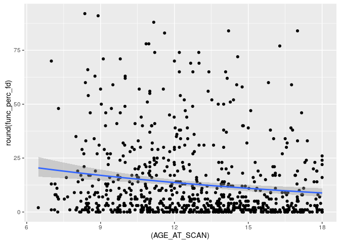<!-- -->

    summary(glm(func_mean_fd ~ AGE_AT_SCAN, family='quasipoisson', data=aDF))

    ## 
    ## Call:
    ## glm(formula = func_mean_fd ~ AGE_AT_SCAN, family = "quasipoisson", 
    ##     data = aDF)
    ## 
    ## Deviance Residuals: 
    ##      Min        1Q    Median        3Q       Max  
    ## -0.47203  -0.26273  -0.15806   0.02104   1.94635  
    ## 
    ## Coefficients:
    ##             Estimate Std. Error t value Pr(>|t|)    
    ## (Intercept) -1.24008    0.20548  -6.035 2.49e-09 ***
    ## AGE_AT_SCAN -0.05715    0.01622  -3.523 0.000453 ***
    ## ---
    ## Signif. codes:  0 '***' 0.001 '**' 0.01 '*' 0.05 '.' 0.1 ' ' 1
    ## 
    ## (Dispersion parameter for quasipoisson family taken to be 0.2156552)
    ## 
    ##     Null deviance: 100.098  on 756  degrees of freedom
    ## Residual deviance:  97.407  on 755  degrees of freedom
    ##   (13 observations deleted due to missingness)
    ## AIC: NA
    ## 
    ## Number of Fisher Scoring iterations: 5

    ggplot(aDF, aes(x=(AGE_AT_SCAN), y=func_mean_fd))+
        geom_point()+
        geom_smooth(method='glm', method.args=list(family='quasipoisson'))

    ## Warning: Removed 13 rows containing non-finite values (stat_smooth).

    ## Warning: Removed 13 rows containing missing values (geom_point).

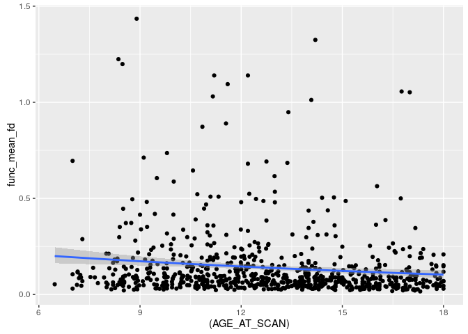<!-- -->

The percentage of volumes with motion \> threshold is basically a count
variable (normalized), so we should treat it as something like poisson
distributed (most people have only a few, bounded at 0, but some people
have a lot). We can predict the rate of bad volumes with age and find a
small decrease in the expected rate with age. This is as expected. All
this taken together can give us confidence that we are interpreting this
measure correctly.

Data checking
=============

    rsqDF <- read.csv('./RESULTS_bin/SummaryRsqs.csv', stringsAsFactors=F)

    head(rsqDF) 

    ##   motion_thresh   med_rsq      CI_95   med_icc  CI_95_icc   n age_l age_u
    ## 1            50 0.8674949 0.15140379 0.9343760 0.07460912  20     6    18
    ## 2            65 0.9098184 0.14721701 0.9554864 0.06453941  30     6    18
    ## 3            60 0.9727018 0.03760561 0.9862242 0.01718400 100     6    18
    ## 4            35 0.9673424 0.05291633 0.9836591 0.02506813  80     6    18
    ## 5            60 0.9536688 0.07605641 0.9769735 0.03599832  60     6    18
    ## 6            70 0.9326666 0.07137071 0.9662165 0.03895027  40     6    18

    #Check frequencies and distributions
    table(rsqDF$motion_thresh)

    ## 
    ##  5 10 15 20 25 30 35 40 45 50 55 60 65 70 75 80 
    ## 10 10 10 10 10 10 10 10 10 10 10 10 10 10 10 10

    table(rsqDF$n)

    ## 
    ##  10  20  30  40  50  60  70  80  90 100 
    ##  16  16  16  16  16  16  16  16  16  16

    table(rsqDF$age_l-rsqDF$age_u)

    ## 
    ## -12 
    ## 160

    table(rsqDF[,c('motion_thresh', 'n')])

    ##              n
    ## motion_thresh 10 20 30 40 50 60 70 80 90 100
    ##            5   1  1  1  1  1  1  1  1  1   1
    ##            10  1  1  1  1  1  1  1  1  1   1
    ##            15  1  1  1  1  1  1  1  1  1   1
    ##            20  1  1  1  1  1  1  1  1  1   1
    ##            25  1  1  1  1  1  1  1  1  1   1
    ##            30  1  1  1  1  1  1  1  1  1   1
    ##            35  1  1  1  1  1  1  1  1  1   1
    ##            40  1  1  1  1  1  1  1  1  1   1
    ##            45  1  1  1  1  1  1  1  1  1   1
    ##            50  1  1  1  1  1  1  1  1  1   1
    ##            55  1  1  1  1  1  1  1  1  1   1
    ##            60  1  1  1  1  1  1  1  1  1   1
    ##            65  1  1  1  1  1  1  1  1  1   1
    ##            70  1  1  1  1  1  1  1  1  1   1
    ##            75  1  1  1  1  1  1  1  1  1   1
    ##            80  1  1  1  1  1  1  1  1  1   1

    table(rsqDF[,c('age_l', 'n')])

    ##      n
    ## age_l 10 20 30 40 50 60 70 80 90 100
    ##     6 16 16 16 16 16 16 16 16 16  16

    table(rsqDF[,c('motion_thresh', 'age_l')])

    ##              age_l
    ## motion_thresh  6
    ##            5  10
    ##            10 10
    ##            15 10
    ##            20 10
    ##            25 10
    ##            30 10
    ##            35 10
    ##            40 10
    ##            45 10
    ##            50 10
    ##            55 10
    ##            60 10
    ##            65 10
    ##            70 10
    ##            75 10
    ##            80 10

    ggplot(rsqDF, aes(x=med_rsq))+geom_histogram(aes(y=..density..))+geom_density()

    ## `stat_bin()` using `bins = 30`. Pick better value with `binwidth`.

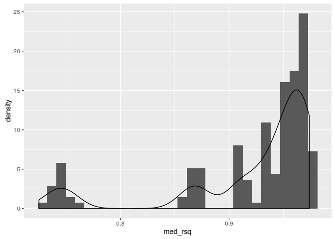<!-- -->

*R*2 plots
=====================

    #Plot the fun stuff

    n_color_age_facet <- ggplot(rsqDF, aes(x=motion_thresh, y=med_rsq, group=(n), color=(n)))+
        geom_errorbar(aes(ymin=med_rsq-CI_95/2, 
                  ymax=med_rsq+CI_95/2), 
                  width=0, alpha=.6)+
        facet_wrap(~age_l)+
        coord_cartesian(y=c(.5, 1))+
        scale_color_gradient(low='gray', high='darkblue')

    age_color_n_facet <- ggplot(rsqDF, aes(x=motion_thresh, y=med_rsq, group=factor(age_l), color=factor(age_l)))+
        geom_errorbar(aes(ymin=med_rsq-CI_95/2, 
                  ymax=med_rsq+CI_95/2), 
                  width=0, alpha=.2)+
        coord_cartesian(y=c(.8, 1))+
        facet_wrap(~n)

    plotThing <- function(aPlot){
        aPlot + 
            geom_point(alpha=.2)+
            geom_line(alpha=.5)+
            scale_x_continuous(trans='identity')+
            scale_y_continuous(trans='identity')
    }

    plotThing(n_color_age_facet)

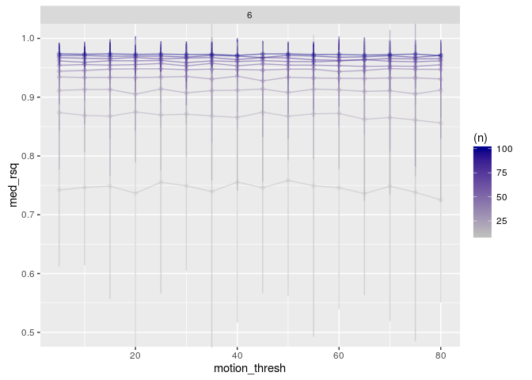<!-- -->

    plotThing(age_color_n_facet)

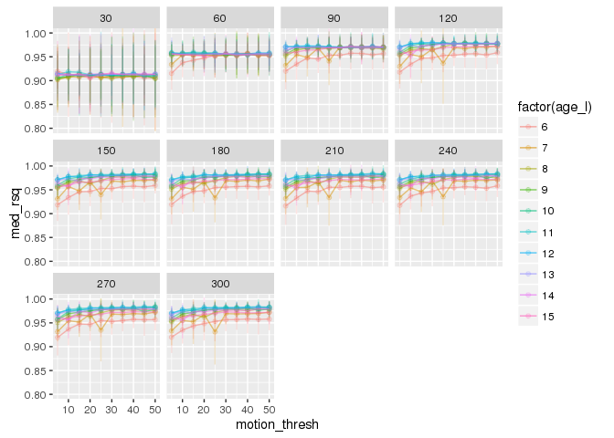<!-- -->

ICC plots
=========

    ggplot(rsqDF, aes(x=med_icc))+geom_histogram(aes(y=..density..))+geom_density()

    ## `stat_bin()` using `bins = 30`. Pick better value with `binwidth`.

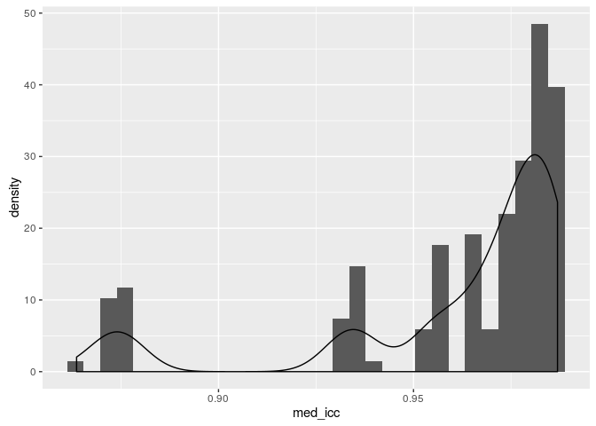<!-- -->

    #Plot the fun stuff

    n_color_age_facet <- ggplot(rsqDF, aes(x=motion_thresh, y=med_icc, group=(n), color=(n)))+
        geom_errorbar(aes(ymin=med_icc-CI_95_icc/2, 
                  ymax=med_icc+CI_95_icc/2), 
                  width=0, alpha=.6)+
        facet_wrap(~age_l)+
        coord_cartesian(y=c(.5, 1))+
        scale_color_gradient(low='darkgray', high='darkblue')

    age_color_n_facet <- ggplot(rsqDF, aes(x=motion_thresh, y=med_icc, group=factor(age_l), color=factor(age_l)))+
        geom_errorbar(aes(ymin=med_icc-CI_95_icc/2, 
                  ymax=med_icc+CI_95_icc/2), 
                  width=0, alpha=.5)+
        coord_cartesian(y=c(.8, 1))+
        facet_wrap(~n)

    plotThing <- function(aPlot){
        aPlot + 
            geom_point(alpha=.5)+
            geom_line(alpha=.5)+
            scale_x_continuous(trans='identity')+
            scale_y_continuous(trans='identity')
    }

    plotThing(n_color_age_facet)

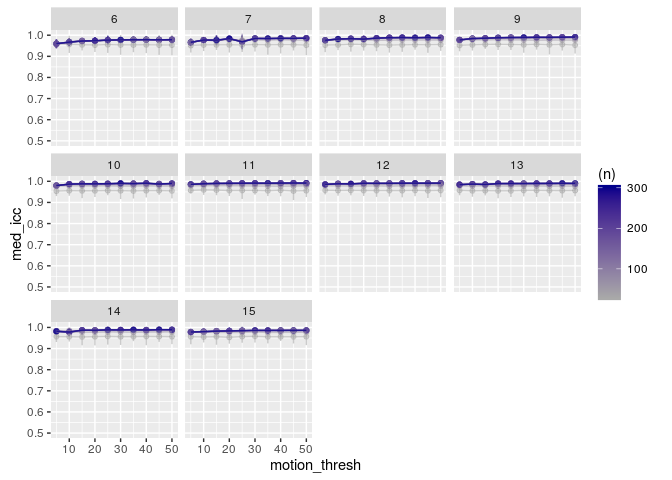<!-- -->

    plotThing(age_color_n_facet)

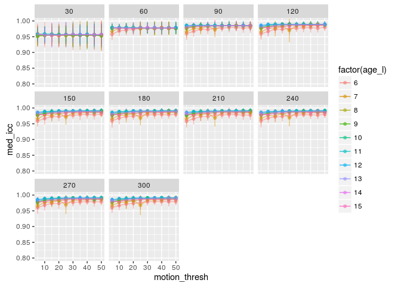<!-- -->

Within motion cutoffs
=====================

    within_cutoff_plot <- ggplot(rsqDF, aes(x=n, y=med_rsq, group=motion_thresh, color=motion_thresh))+
        geom_errorbar(aes(ymin=med_icc-CI_95_icc/2, 
                  ymax=med_icc+CI_95_icc/2), 
                  width=0, alpha=.5)+
        coord_cartesian(y=c(.7, 1))+
        facet_wrap(~age_l)
    plotThing(within_cutoff_plot) 

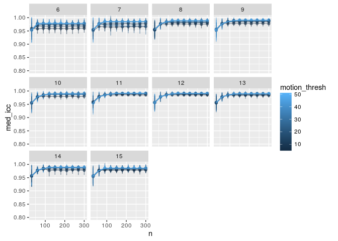<!-- -->

    within_cutoff_plot <- ggplot(rsqDF, aes(x=n, y=med_icc, group=motion_thresh, color=motion_thresh))+
        geom_errorbar(aes(ymin=med_icc-CI_95_icc/2, 
                  ymax=med_icc+CI_95_icc/2), 
                  width=0, alpha=.5)+
        coord_cartesian(y=c(.7, 1))+
        facet_wrap(~age_l)
    plotThing(within_cutoff_plot) 

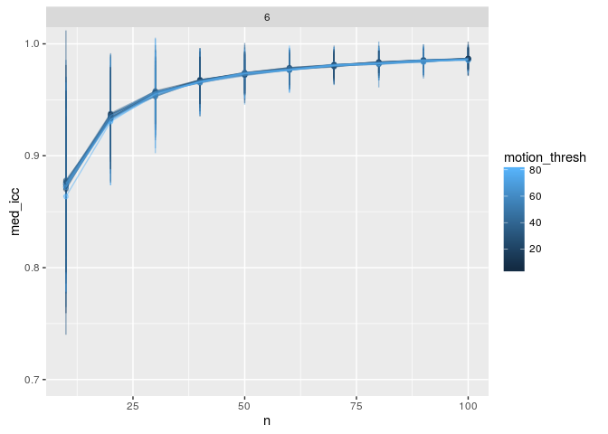<!-- -->
