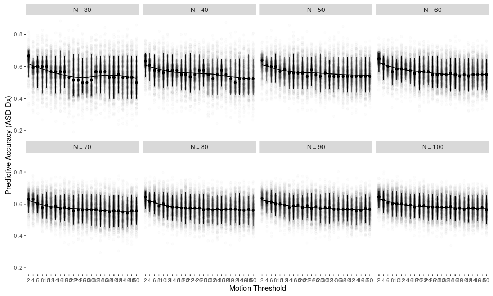
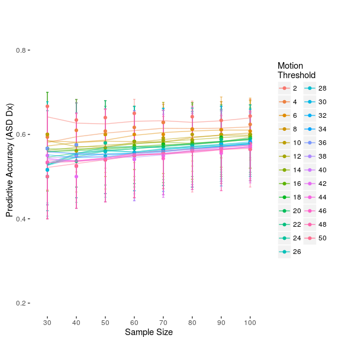
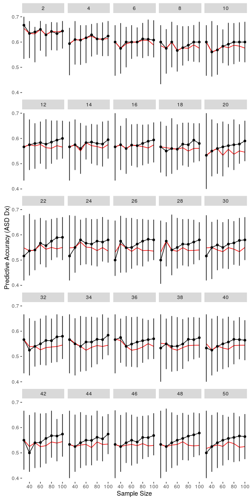

    library(data.table)
    library(dplyr)
    library(tidyr)
    library(ggplot2)

    testAccDataFile <- './cv_output/sss_svc_run2/TestAcc.csv'

    if(!file.exists(testAccDataFile)){
        #Remember to extract the files from TestAcc.tar.gz first
        cvFiles <- dir('./cv_output/sss_svc_run2/TestAccData', pattern='*_TestAcc.csv', full.names = TRUE) 
        lst <- lapply(cvFiles, fread)
        cvData <- rbindlist(lst)
        cvData[,'file'] <- cvFiles
        cvData <- cvData[, c('cvMethod', 'classifier', 'mt', 'n', 'i'):=tstrsplit(tstrsplit(file, '/')[[5]], '_(mt|n|i)*')]
        freqFiles <- dir('./cv_output/sss_svc_run2/TestLabelFreqData', pattern='*_TestLabelFreq.csv', full.names = TRUE) 
        flst <- lapply(freqFiles, fread, skip=1)
        freqData <- rbindlist(flst)
        freqData[,'file'] <- freqFiles
        freqData <- freqData[, c('cvMethod', 'classifier', 'mt', 'n', 'i'):=tstrsplit(tstrsplit(file, '/')[[5]], '_(mt|n|i)*')]
        setnames(freqData, c('V1', 'V2'), c('N_DX_1', 'N_DX_2'))
        setnames(cvData, 'V1', 'TestAcc')
        setkey(cvData, mt, n, i) 
        setkey(freqData, mt, n, i) 
        cvData.final <- cvData[freqData[, c('file', 'cvMethod', 'classifier'):=NULL]]
        cvData.final[, prop2 := (N_DX_2/(N_DX_1+N_DX_2))]  
        cvData.final <- cvData.final[, mt:=factor(mt, levels=seq(2, 50, 2))]
        cvData.final <- cvData.final[, n:=factor(n, levels=seq(30, 100, 10))]
        fwrite(cvData.final, testAccDataFile)
    } else {
        cvData.final <- fread(testAccDataFile)
    }

    summaryCV <- cvData.final[, c(as.list(quantile(TestAcc, probs=c(.05, .5, .95))), 
                      prop2.m=mean(prop2)), keyby=c('mt', 'n')]

    N_labels <- paste0('N = ', unique(cvData.final$n))
    names(N_labels) <- unique(cvData.final$n)

    ggplot(summaryCV, aes(x=as.numeric(mt), y=`50%`))+
        geom_line()+
        geom_line(aes(x=as.numeric(mt), y=`prop2.m`),
              color='red')+
        geom_point(aes(x=as.numeric(mt), y=`50%`))+
        geom_errorbar(aes(x=as.numeric(mt), y=NULL, ymin=`5%`, ymax=`95%`), width=0)+
        facet_wrap(~n, nrow=2, labeller=labeller(n=N_labels))+
        theme(panel.background=element_rect(fill='white'))+
        labs(x='Motion Threshold', y='Predictive Accuracy (ASD Dx)')

<!-- -->

    ggplot(cvData.final, aes(x=n, y=TestAcc, group=mt, color=mt))+
        geom_point(alpha=.0, position=position_jitter(width=.5, height=.1))+
        geom_errorbar(data=summaryCV, aes(x=n, y=NULL, ymin=`5%`, ymax=`95%`),
               width=2, alpha=.5, position=position_dodge(w=0))+
        geom_point(data=summaryCV, aes(x=n, y=`50%`), position=position_dodge(w=0))+
        geom_line(aes(group=mt, color=mt), stat='smooth', method='loess', alpha=.5)+ 
        theme(panel.background=element_rect(fill='white'))+
        labs(x='Sample Size', y='Predictive Accuracy (ASD Dx)',
             color='Motion\nThreshold')

<!-- -->

    ggplot(summaryCV, aes(x=as.numeric(n), y=`50%`))+
        geom_line()+
        geom_line(aes(x=as.numeric(n), y=`prop2.m`),
              color='red')+
        geom_point(aes(x=as.numeric(n), y=`50%`))+
        geom_errorbar(aes(x=as.numeric(n), y=NULL, ymin=`5%`, ymax=`95%`), width=0)+
        facet_wrap(~mt, nrow=5)+
        theme(panel.background=element_rect(fill='white'))+
        labs(x='Sample Size', y='Predictive Accuracy (ASD Dx)',
             color='Motion\nThreshold')

<!-- -->
